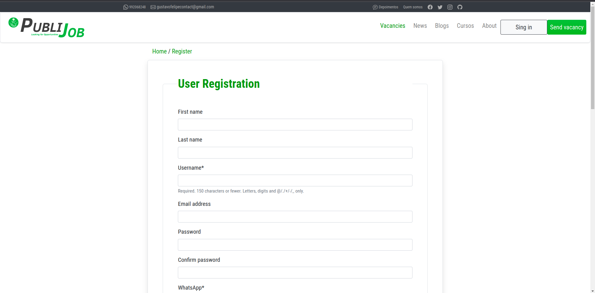
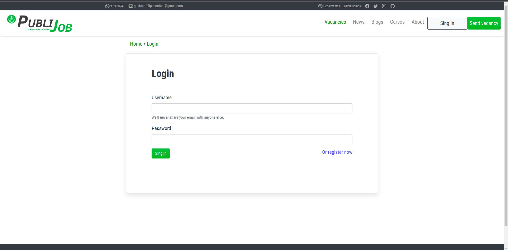
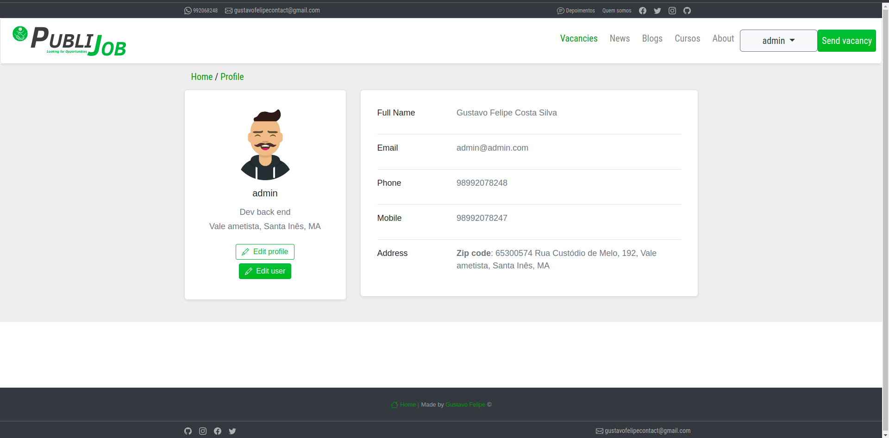

<p>PubliJob é uma plataforma inovadora que simplifica a busca e candidatura a oportunidades de emprego.</p>
</p>O objetivo é conectar talentos a empresas em crescimento, tornando o processo de recrutamento mais eficiente.</p>


<!-- 


 -->

### Preparar ambiente

Para executar o projeto, foi utilizado pyenv na versão 3.11.0 do python para o ambiente virtual.

Ao optar por usar pyenv, após a instalação, execute:
```bash
make pyenv
```
<br>
Em seguida, para instalar os pacotes:

```bash
make setup-dev
```

### Banco de dados
<br>
No arquivo settings.py do projeto, em `DATABASES`, substitua as informações de conexão do banco de dados:

```bash
DATABASES = {
    'default': {
        'ENGINE': 'django.db.backends.mysql',
        'NAME': 'publijob',
        'USER': 'seu_usuario',
        'PASSWORD': 'sua_senha',
        'HOST': 'localhost',  # ou o endereço do seu servidor
        'PORT': 'porta_escolhida', # deixe em branco para usar a padrão
    }
}
```

Execute o seguinte comando para aplicar as migrações ao banco de dados:

```bash
make migrate-db
```

### Execução

Use o seguinte comando para executar o projeto:

```bash
python manage.py runserver
```
Digite http://localhost:8000/ ou endereço do seu servidor em seu navegador para acessar o site