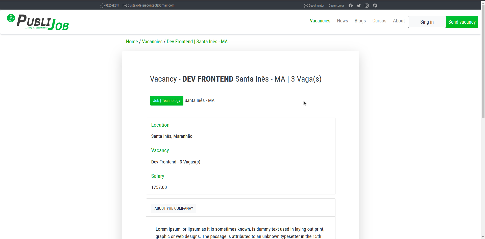

<p>PibliJob é uma plataforma inovadora que simplifica a busca e candidatura a oportunidades de emprego.</p>
</p>O objetivo é conectar talentos a empresas em crescimento, tornando o processo de recrutamento mais eficiente.</p>





## Instalação

Para executar o projeto, utilizei a pyenv, com a versão 3.11.0 do python para o ambiente virtual.

Ao optar usar pyenv, após a instalação, execute:
```bash
pyenv virtualenv 3.11.1 publi
pyenv activate publi
pip install -r requirements.txt
```